# DyGraphQA: Evaluating LLMs on Fully Dynamic Graph Reasoning Tasks

This repository contains code for generating and evaluating LLMs on both DyGraphQA-Real and DyGraphQA-Synth.

---

# DyGraphQA-Real

## 🔧 Setup

1. **Download the dataset**

   Download the real-world coauthorship graph from the DBLP project:

   🔗 https://projects.csail.mit.edu/dnd/DBLP/

   Download `dblp_coauthorship.json.gz` and place it in the root directory of this repo.

2. **Install dependencies**

   ```bash
   pip install -r requirements.txt
   ```

---

## 📈 Generate Graphs

Run the following script to generate graphs from the real-world coauthorship network:

```bash
python3 graph_generator.py --n_graphs 250 --experimentType "real"
```

> 🔢 Use any value for `--n_graphs`, but we use `250` in our paper.

---

## 🤖 Evaluate Models on Graph Tasks

Once graphs are generated, evaluate an LLM on a specific graph reasoning task:

```bash
python3 real_model_eval.py \
  --model $MODEL \
  --size "405B" \
  --graph_size $SIZE \
  --task $TASK
```

### ✅ Valid options:

- **`--model`**  
  - `gpt-4o-mini`  
  - `o1-mini`  
  - `o3-mini`  
  - `claude-3-7-sonnet-20250219`  
  - `llama3.1`
 
 - **`--graph_size`**  
  - `small`  
  - `medium`  
  - `large`

- **`--task`**  
  - `node_count`  
  - `edge_count`  
  - `node_degree`  
  - `connected_nodes`  
  - `print_graph`  
  - `isolated_nodes`  
  - `triangle_count`  
  - `overlapped_nodes`  
  - `overlapped_edges`
  
---

# DyGraphQA-Synth

## 📈 Generate Graphs

Run the following script to generate synthetic graphs:

```bash
python3 graph_generator.py --n_graphs $n_graphs --experimentType "encoding_chain"
```

> 🔢 Again, we use `250` in our paper.

---

## 🤖 Evaluate Models on Graph Tasks

After generating graphs, you can evaluate an LLM on specific graph reasoning tasks using the following command:

```bash
python3 model_eval.py \
  --model $MODEL \
  --size "405B" \
  --prompt_types $PROMPT_TYPE \
  --modification $MODIFICATION \
  --encoding $ENCODING \
  --chainLength $CHAIN_LENGTH \
  --ablation True \
  --ablationType "encoding_chain_no_print"
```

### ✅ Valid Options

- **`--model`**  
  - `gpt-4o-mini`  
  - `o1-mini`  
  - `o3-mini`  
  - `claude-3-7-sonnet-20250219`  
  - `llama3.1`

- **`--prompt_types`**  
  Graph reasoning task:
  - `node_count`  
  - `edge_count`  
  - `node_degree`  
  - `connected_nodes`  
  - `print_graph`

- **`--modification`**  
  Type of graph modification:
  - `add_edge`  
  - `remove_edge`  
  - `add_node`  
  - `remove_node`  
  - `mix`

- **`--encoding`**  
  Graph encoding format:
  - `adjacency_matrix`

- **`--chainLength`**  
  Length of modification chain:
  - `1`, `2`, `3`, `4`, `5`

---

### 🔁 Example Usage

```bash
python3 model_eval.py \
  --model gpt-4o-mini \
  --size 405B \
  --prompt_types "node_count" \
  --ablation True \
  --ablationType "encoding_chain_no_print" \
  --modification "mix" \
  --encoding "adjacency_matrix" \
  --chainLength 5
```

---

# DyGraphQA-Real Dataset Statistics

# Small Graphs

<p align="center">
  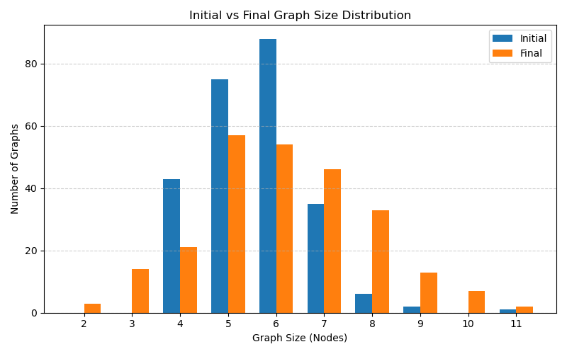
  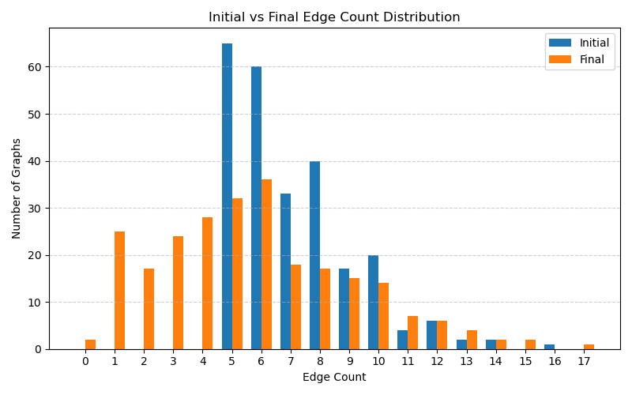
  <br><br>
  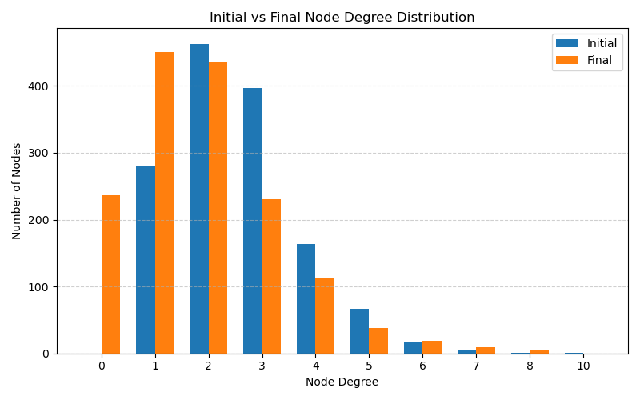
  
</p>

# Medium Graphs

<p align="center">
  
  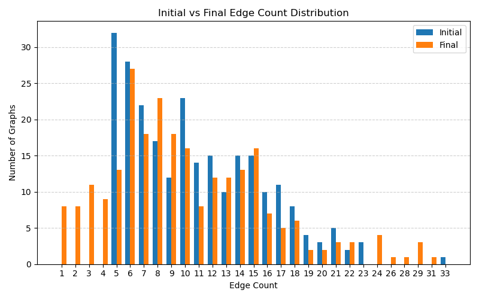
  <br><br>
  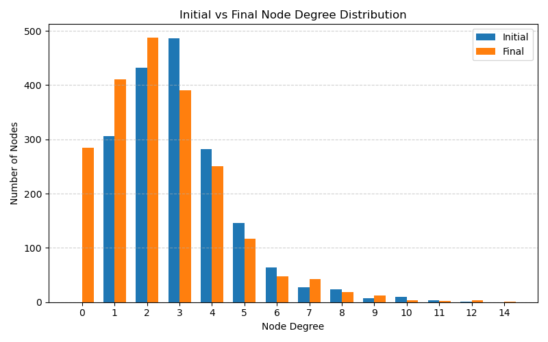
  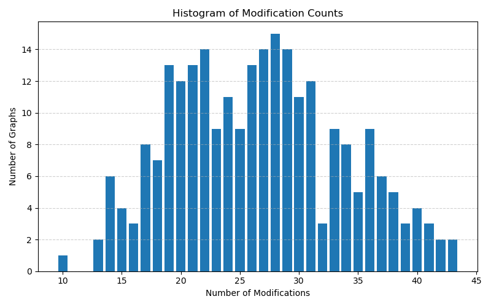
</p>

# Large Graphs

<p align="center">
  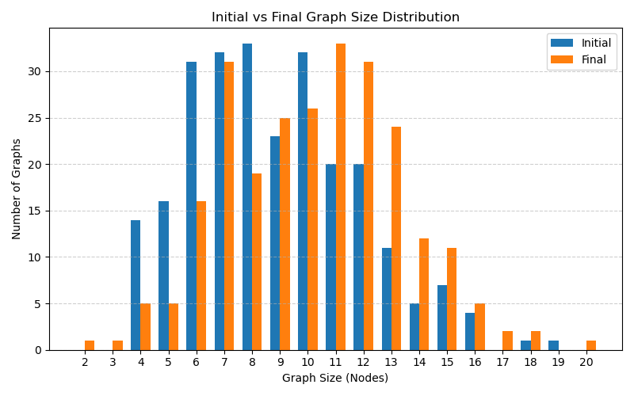
  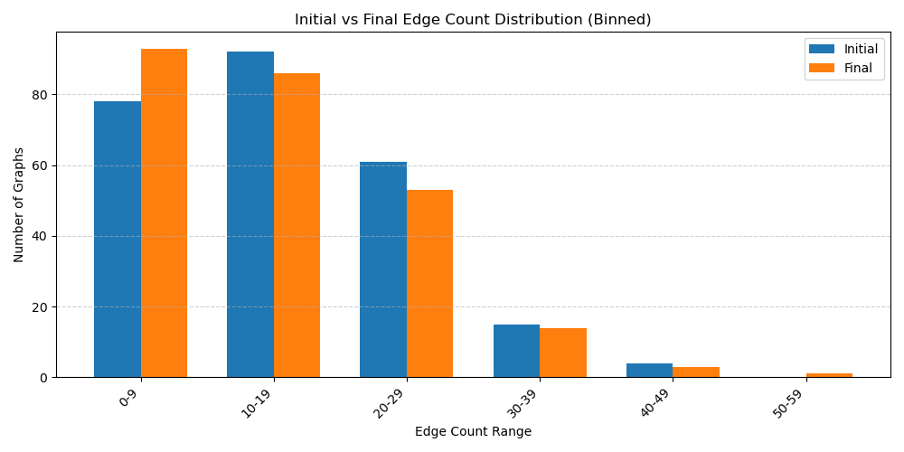
  <br><br>
  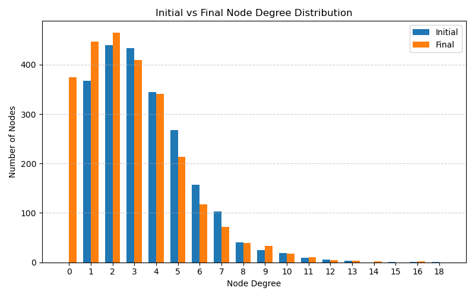
  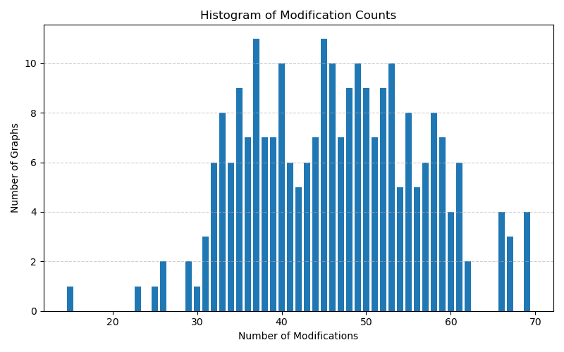
</p>

| Size   |   Graphs Processed | Initial Node Count   | Final Node Count   | Initial Node Degree   | Final Node Degree   | Initial Edge Count   | Final Edge Count   | Modifications   |
|:-------|-------------------:|:---------------------|:-------------------|:----------------------|:--------------------|:---------------------|:-------------------|:----------------|
| Small  |                250 | 5.59 ± 1.11          | 6.14 ± 1.75        | 2.54 ± 1.21           | 1.86 ± 1.41         | 7.10 ± 2.07          | 5.73 ± 3.32        | 13.74 ± 3.04    |
| Medium |                250 | 7.16 ± 2.20          | 8.28 ± 2.69        | 3.06 ± 1.70           | 2.46 ± 1.90         | 10.93 ± 4.92         | 10.17 ± 5.91       | 26.58 ± 7.09    |
| Large  |                250 | 8.86 ± 3.01          | 10.20 ± 3.09       | 3.57 ± 2.17           | 2.86 ± 2.34         | 15.84 ± 8.95         | 14.60 ± 9.53       | 46.33 ± 10.05   |

---

# DyGraphQA-Synth Dataset Statistics

<p align="center">
  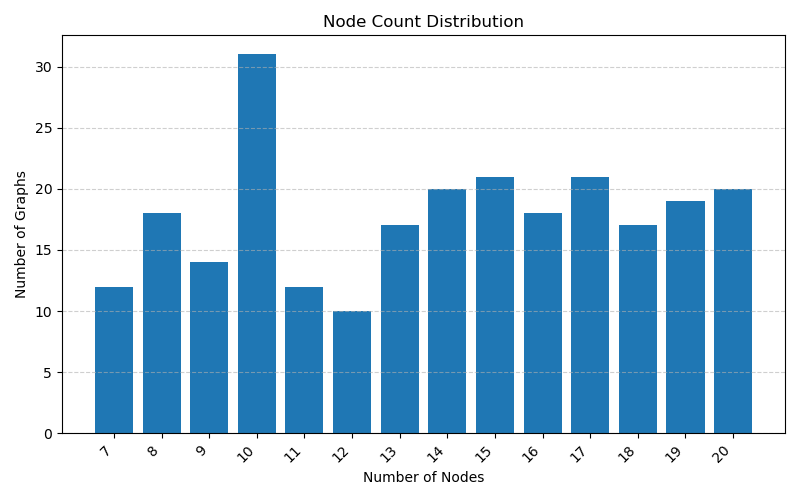
  <br><br>
  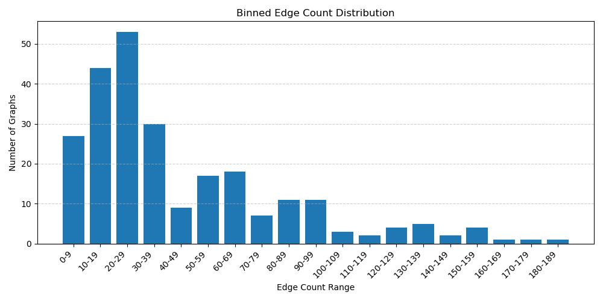
  <br><br>
  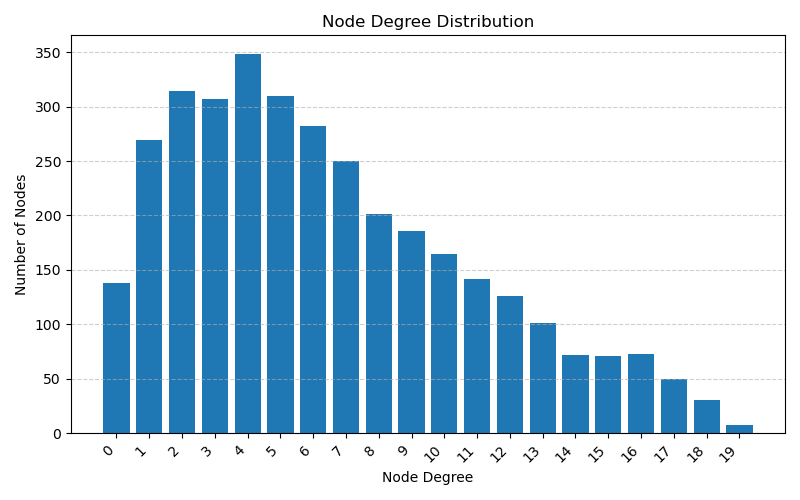
</p>

|   Graphs Processed | Average Node Count   | Average Edge Count   | Average Node Degree   |
|-------------------:|:---------------------|:---------------------|:----------------------|
|                250 | 13.78 ± 3.99         | 44.64 ± 38.71        | 6.48 ± 4.45           |

---

# DyGraphQA-Synth Dataset Generation Pseudocode

<p align="center">
  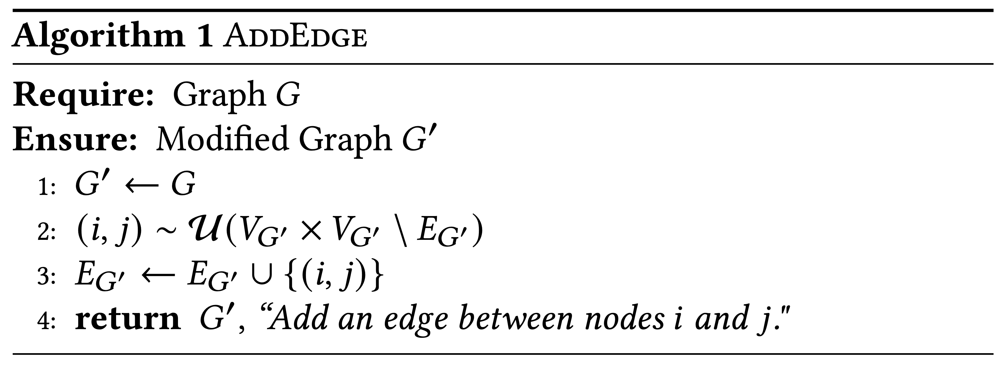
  <br><br>
  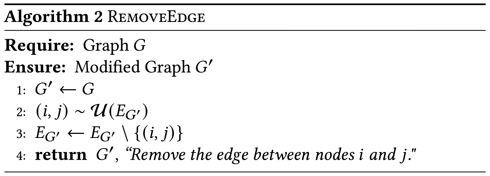
  <br><br>
  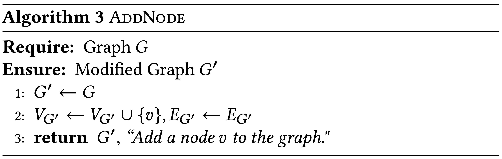
  <br><br>
  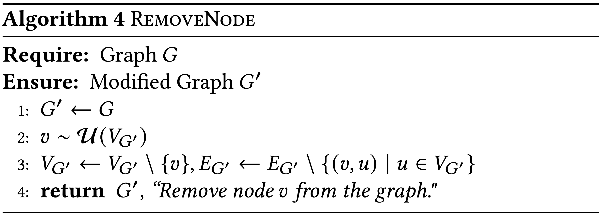
  <br><br>
  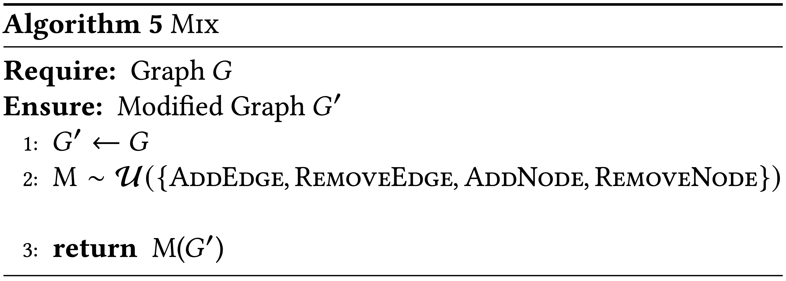
  <br><br>
  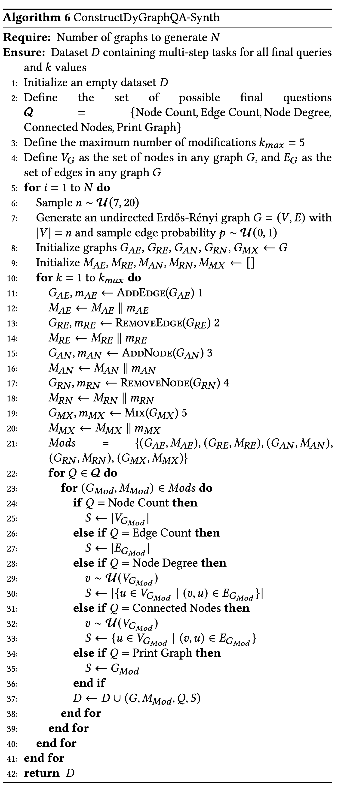
  <br><br>
</p>

---

# DyGraphQA-Synth Example Prompt & LLM Output Visualizations

<p align="center">
  
  <br><br>
  
  <br><br>
  
  <br><br>
</p>

# 📄 Citation

If you use this code in your work, please cite our paper (coming soon).
